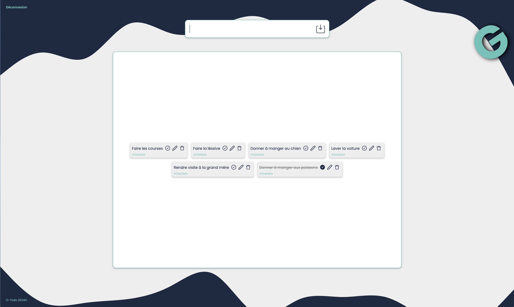

# G Todo List Front

<kbd></kbd>

## Instalation des dépendences

Lancer la commande `yarn` à la racine du projet.

## Lancer le serveur

Lancer la commande `yarn start` 

Une fois le serveur back et front lancé profiter de la G-Todo List. 

